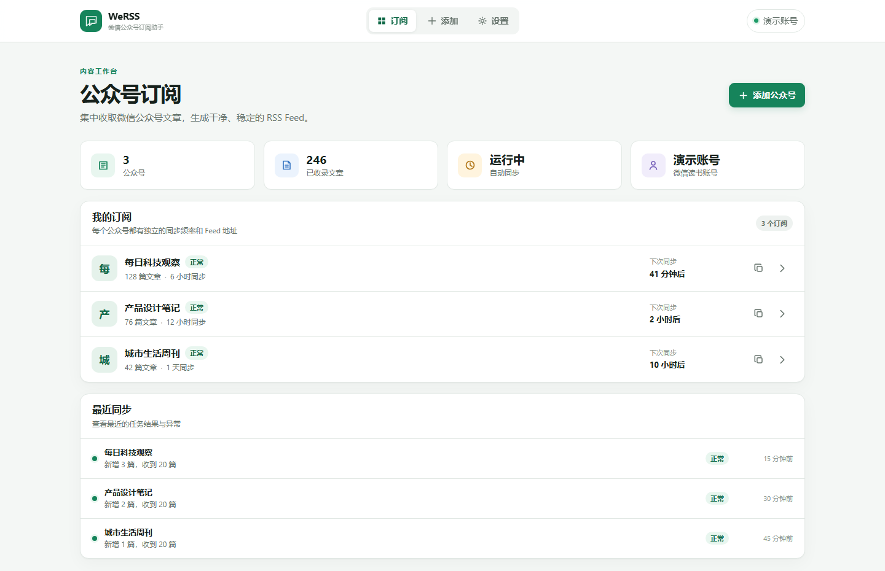
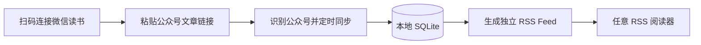

<div align="center">
  
  <h1>WeRSS</h1>
  <p><strong>把微信公众号带回你的 RSS 阅读器。</strong></p>
  <p>扫码登录 · 自动同步 · 独立 Feed · 一键启动 · 完全自托管</p>

  <p>
    <a href="https://github.com/johamwon/wechrss/actions/workflows/ci.yml"></a>
    <a href="https://github.com/johamwon/wechrss/blob/main/LICENSE"></a>
    
    
    <a href="https://github.com/johamwon/wechrss/stargazers"></a>
  </p>

  <p>
    <a href="#quick-start">快速开始</a> ·
    <a href="#features">功能亮点</a> ·
    <a href="#configuration">配置</a> ·
    <a href="./docs/TECHNICAL_GUIDE.md">技术指南</a> ·
    <a href="https://github.com/johamwon/wechrss/issues">反馈问题</a>
  </p>
</div>



WeRSS 是一个简洁的微信公众号 RSS 助手。粘贴任意一篇公众号文章链接，它会识别公众号、定时同步文章元数据，并为每个公众号生成独立 Feed。数据和凭证都保存在你自己的设备上。

> 如果 WeRSS 对你有帮助，欢迎点一个 [Star](https://github.com/johamwon/wechrss) ⭐。这会让更多喜欢 RSS 的人发现它。

<a id="features"></a>

## ✨ 为什么选择 WeRSS

| | 能力 | 体验 |
|---|---|---|
| 🧭 | **链接即订阅** | 粘贴公众号文章链接，自动识别公众号，无需寻找复杂参数 |
| 📡 | **独立 RSS Feed** | 每个公众号单独设置同步频率、Feed 条数与启停状态 |
| 📱 | **扫码登录** | 在 Web 界面连接微信读书，可用时自动续期会话 |
| ⏱️ | **自动同步** | 后台调度、同步记录与异常状态一目了然 |
| 🗄️ | **本地持久化** | SQLite 单机存储，方便迁移与备份，不依赖外部数据库 |
| 🚀 | **小白友好** | Windows 双击启动，macOS / Linux 一条命令，也支持 Docker |
| 🛡️ | **默认安全** | 仅监听本机，支持 Basic Auth、CSRF 与安全响应头 |
| 🪶 | **克制抓取** | 只整理标题、时间、封面、摘要和原文链接，不抓取文章正文 |

<a id="quick-start"></a>

## 🚀 30 秒开始

先安装 [Python 3.10 或更高版本](https://www.python.org/downloads/)，然后 [下载项目 ZIP](https://github.com/johamwon/wechrss/archive/refs/heads/main.zip) 并解压。

### Windows

双击项目里的：

```text
start.bat
```

### macOS / Linux

在项目目录运行：

```bash
bash start.sh
```

首次启动会自动创建虚拟环境、安装依赖和 Chromium，并在就绪后打开浏览器。以后启动会直接复用；停止服务时关闭启动窗口或按 `Ctrl+C`。

打开 <http://127.0.0.1:8080> 后，只需三步：

1. 在「设置」中使用微信扫码登录；
2. 点击「添加」，粘贴任意一篇公众号文章链接；
3. 同步完成后，复制 Feed 地址到你的 RSS 阅读器。

<details>
<summary><strong>使用 Docker Compose</strong></summary>

```bash
cp .env.example .env
docker compose up -d --build
```

检查服务：

```bash
curl http://127.0.0.1:8080/api/health
docker compose logs -f --tail=200 wechat-mp-fetcher
```

</details>

<details>
<summary><strong>手工安装（开发者）</strong></summary>

```bash
python -m venv .venv
source .venv/bin/activate
pip install -r requirements.txt
python -m playwright install chromium
python web_app.py
```

Windows PowerShell 激活虚拟环境：

```powershell
.venv\Scripts\Activate.ps1
```

</details>

## 🧩 它如何工作



WeRSS 获取并保存文章的标题、发布时间、封面、摘要和微信原文链接。Feed 始终把阅读行为带回原文页面，Web 与 CLI 默认流程不会抓取或保存文章正文。

## 🔒 部署与使用边界

> [!IMPORTANT]
> 本项目依赖非公开且可能变化的微信读书移动端接口。请仅访问你有权访问的内容，并遵守相关平台条款。WeRSS 不处理验证码、不绕过人工验证，也不会通过代理轮换或高频重试规避风控。

默认 Docker 端口仅绑定本机：

```text
127.0.0.1:8080:8080
```

从其他设备访问时，推荐使用 SSH 隧道：

```bash
ssh -L 8080:127.0.0.1:8080 user@server
```

如需监听局域网地址，请在 `.env` 中设置强密码，并在公网场景下配置 HTTPS 反向代理：

```env
BIND_ADDRESS=0.0.0.0
ADMIN_PASSWORD=换成足够强的密码
```

管理用户名固定为 `admin`。敏感凭证保存在 `data/credentials.json`，该文件已被 Git 忽略，但仍应限制访问权限并安全备份。

<a id="configuration"></a>

## ⚙️ 配置

| 变量 | 默认值 | 说明 |
|---|---:|---|
| `ADMIN_PASSWORD` | 空 | Web Basic Auth 密码；远程访问时必须设置 |
| `BIND_ADDRESS` | `127.0.0.1` | Compose 暴露地址 |
| `PORT` | `8080` | 服务端口 |
| `WEREAD_MIN_INTERVAL` | `2` | 微信读书请求最小间隔（秒） |
| `HTTP_TIMEOUT` | `20` | HTTP 请求超时（秒） |
| `WEREAD_QR_DEADLINE_SECONDS` | `300` | 扫码登录有效时间（秒） |
| `SCHEDULER_POLL_SECONDS` | `30` | 调度器检查周期（秒） |
| `WECHAT_MP_DATA` | `./data` | 数据目录 |
| `WECHAT_MP_DB` | 数据目录内 | SQLite 文件位置 |
| `WECHAT_MP_CREDENTIALS` | 数据目录内 | 凭证文件位置 |

`WEREAD_ACCESS_TOKEN`、`WEREAD_VID` 等旧版变量仅用于兼容迁移。正常使用请在 Web 中扫码登录。

## 💾 数据与备份

```text
data/
├── wechat_mp.db
└── credentials.json
```

Docker 用户可在暂停服务后备份整个数据目录：

```bash
docker compose stop
cp -a data data.backup
docker compose start
```

恢复前请阅读 [CHANGELOG.md](./CHANGELOG.md) 中对应版本的升级说明。

## ❓ 常见问题

<details>
<summary><strong>出现 -2041、HTTP 429 或要求验证怎么办？</strong></summary>

停止重复请求，打开官方微信读书或微信完成人工操作，等待一段时间后再手动尝试一次。WeRSS 不会自动重试这些状态。

</details>

<details>
<summary><strong>登录已过期怎么办？</strong></summary>

扫码登录保存了 RefreshToken 和 Device ID 时，服务会自动续期一次。续期仍失败，请在「设置」中重新扫码。

</details>

<details>
<summary><strong>公众号短链接无法识别怎么办？</strong></summary>

链接解析依次尝试 URL 参数、公开页面 HTML 和 Playwright 浏览器回退；遇到人工验证会直接停止。可用 CLI 查看更具体的错误：

```bash
python wechat_mp_fetcher.py resolve --url "https://mp.weixin.qq.com/s/..."
```

</details>

<details>
<summary><strong>RSS 中包含文章正文吗？</strong></summary>

不包含。Feed 提供标题、发布时间、摘要和微信原文链接，以减少对公开页面的额外访问并保持同步稳定。

</details>

## 🛠️ 开发与贡献

```bash
pip install -r requirements-dev.txt
pytest
ruff check .
```

测试使用模拟响应，不需要真实微信账号，也不会主动请求微信服务。

```text
.
├── web_app.py                 # WSGI 路由与页面
├── service.py                 # 数据库、同步服务与调度器
├── wechat_mp_fetcher.py       # 文章协议、元数据与 RSS
├── weread_auth.py             # 扫码登录与会话续期
├── article_identity.py        # 公众号链接识别
├── templates/                 # Jinja 页面
├── static/                    # 样式与轻量交互
├── scripts/bootstrap.py       # 一键安装启动逻辑
├── start.bat / start.sh       # Windows 与 Unix 启动入口
└── tests/                     # 自动化测试
```

欢迎提交 Bug、文档改进和功能 PR：

- 开始开发前阅读 [贡献指南](./CONTRIBUTING.md)；
- 深入实现细节见 [技术指南](./docs/TECHNICAL_GUIDE.md)；
- 安全问题请按 [安全策略](./SECURITY.md) 私下报告；
- 涉及协议的改动不得加入验证码自动化、代理轮换、高频重试或其他规避平台控制的逻辑。

## 🗺️ 路线图

- [x] 扫码登录与会话续期
- [x] 多公众号独立 Feed 与自动调度
- [x] Windows / macOS / Linux 一键启动
- [x] Docker Compose 与基础安全防护
- [ ] 更完整的导入、导出与迁移体验
- [ ] 更多 RSS 阅读器的使用示例
- [ ] 由社区反馈驱动的新能力

有好想法？欢迎 [发起 Issue](https://github.com/johamwon/wechrss/issues/new)。

---

<div align="center">
  <p><strong>让好内容回到开放、安静、可掌控的阅读方式。</strong></p>
  <p>如果你也喜欢 RSS，请为 WeRSS 点一个 ⭐ Star。</p>
  <p><a href="https://github.com/johamwon/wechrss">⭐ Star WeRSS</a></p>
  <sub><a href="./LICENSE">MIT License</a> · WeRSS contributors</sub>
</div>
